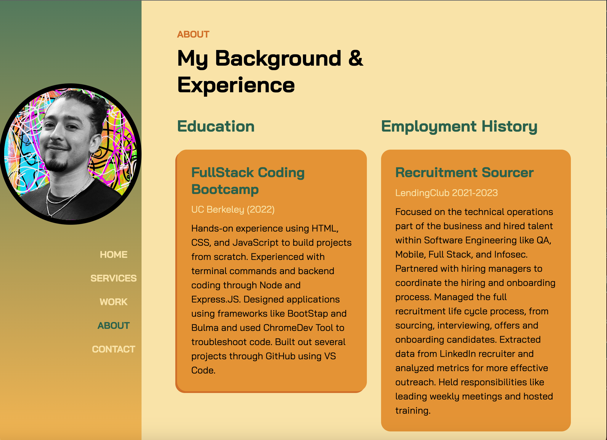

# Portfolio Using Bootstrap  
  ## Description
  Apply bootstrap and have a working and interactive portfolio to show case my work, experience and services. 
  [View Portfolio](https://escotoj.github.io/)

  ## Table of Contents
  - [Credits](#Credits)
  - [License](#License)
  - [Contribute](#Contribute)
  - [Future](#Future)
  
  ## License
  License: MIT License
  
  ## Credits
  Jose Escoto, Full Stack Development Student, University of Berkeley.
  
  ## Contribute to Project
  [Reference](https://www.youtube.com/watch?v=3e8p0R5-b5A)
  
  
  ## Future
  Add freddies pool service, and the book you did as two examples of service, and church as well. 
  maybe add a second page, or add a section specific for art?

  For more questions please contact below: 
  Email: j.escoto@gmail.com 
  GitHub: escotoj

  
